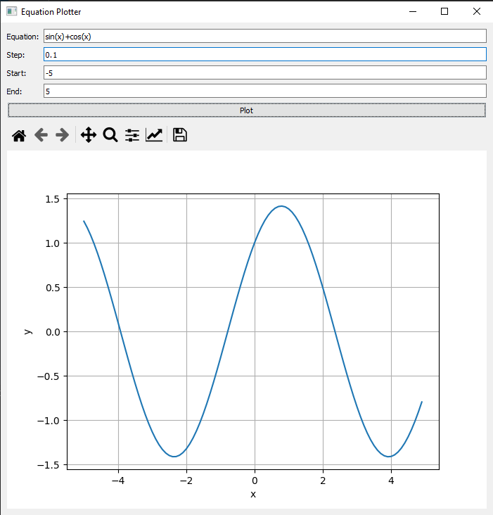
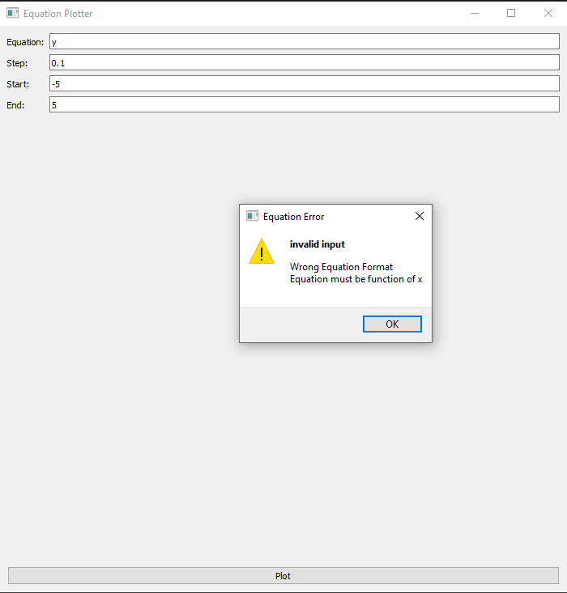
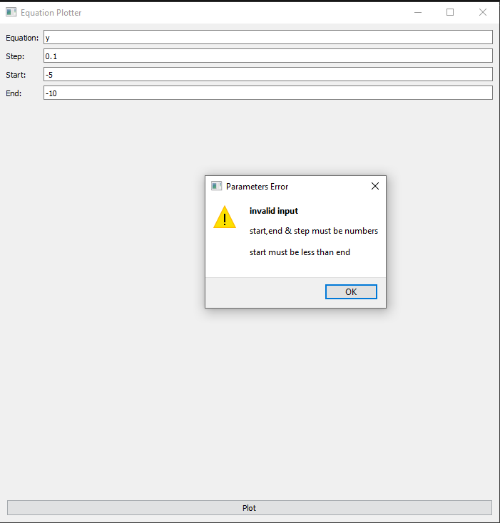

# Equation-Plotter

## Python GUI for plotting equations

## Features

- Draw any given equation
- Select start,end points as well as step
- Error handling in case of wrong equation or parameters
- Ability to navigate the graph with matplotlib tools

## Screenshots:

- working example:

- error handling:

## License

MIT

**Free Software, Hell Yeah!**

